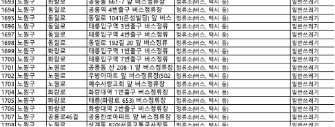
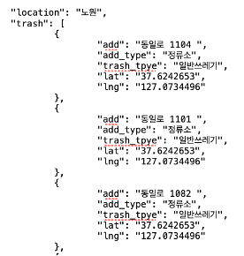
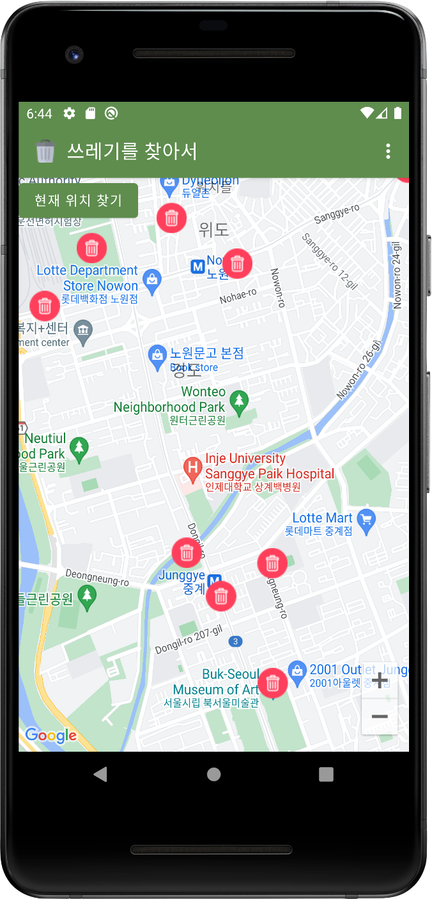
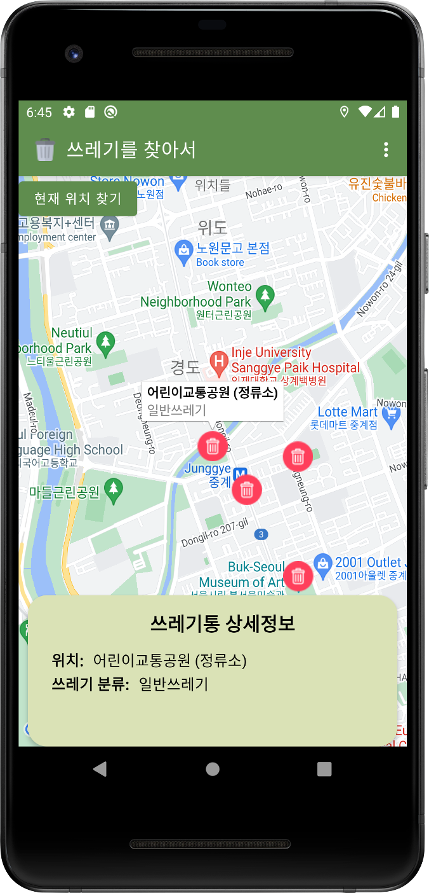
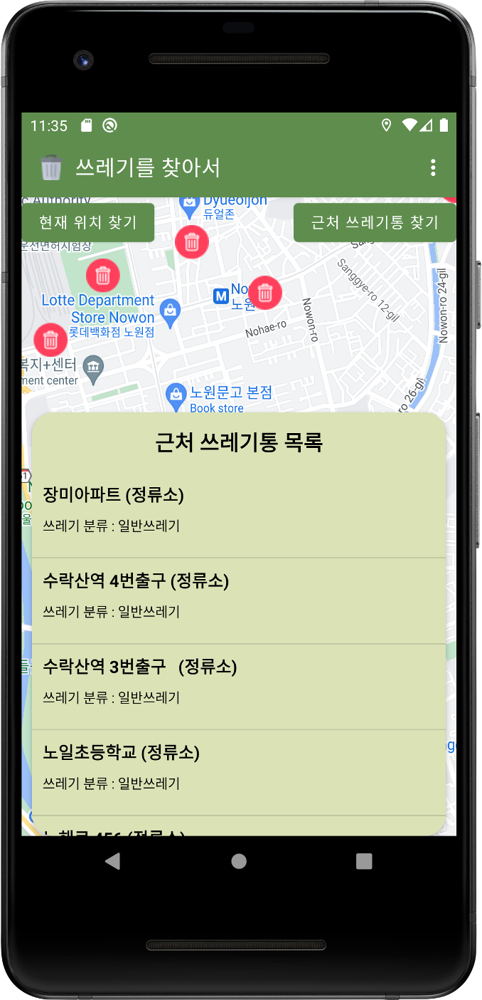
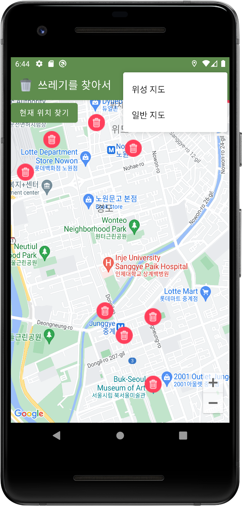
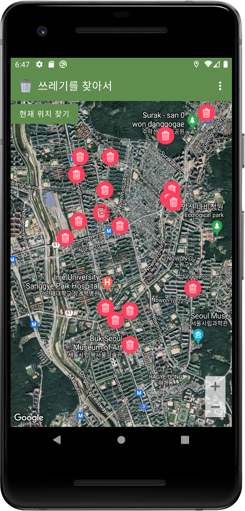

# ♻️ 쓰레기통을 찾아서

## 프로그램 소개 
현재 내 주변의 가까운 쓰레기통 위치를 알려주는 지도 앱

 

## 기획 의도
길을 가며 음료수를 다 마시고 버리려고 하니 주변에 쓰레기통이 없어 계속 
들고 다닌 경험이 한 번쯤은 있을 것이다. 결국 쓰레기통을 찾지 못해 길 모퉁이에 쌓여 있는 쓰레기들도 발견할 수 있다. 또한 최근에는 범람을 막아줄 빗물 받이에 쓰레기와 담배꽁초가 가득 차 폭우가 왔을 때 빗물이 제대로 빠지지 못해 큰 침수피해가 일어났다. 이러한 문제들의 원인 중 하나는 주변에 쓰레기통이 어디에 있는지 인지하지 못하고, 무분별한 무단투기로 인해 발생하는 것으로 파악했다. 무단투기 및 환경오염을 방지하고 자연재해를 막고 무분별하게 버려지는 쓰레기로 인한 사고를 줄이고자 현재 내 주변의 가까운 쓰레기통 위치를 보여주는 지도 앱을 만들게 되었다.

  

## 데이터 정제
서울특별시 쓰레기통의 위치 정보는 서울 열린데이터 광장에서 가져올 수 있었다. 하지만 쓰레기통의 위치가 정확한 경도와 위도로 표시 되어있는 것이 아니라  도로명주소나 버스정류장 등으로 모호하게 표현이 되어있어 쓰레기통의 위치를 표시하기에 힘들어 보였다. 따라서 정확한 경도와 위도값으로 변환해주는 과정을 거쳤다.

|  |  |
|--------------|---------------|
| **공공데이터 - 서울특별시 가로쓰레기통 현황** | **데이터 정제 이후** |

#### 데이터 출처
- 서울 열린데이터 광장. [웹사이트], 서울 노원구 쓰레기통 API 
https://data.seoul.go.kr/dataList/OA-15069/F/1/datasetView.do

  

## 주요 기능
- 구글맵 띄우기
- 쓰레기통 위치 마커로 표시
- 현재 위치 찾기
- 현재위치에서 가까운 쓰레기통 목록 보여주기

  

## 화면 예시 

### 1)  메인 화면

 

### 2) 쓰레기통 상세정보
정제된 데이터 파일을(json) 가져와 지도에 쓰레기통의 위치를 마커로 나타냈다. 마커를 클릭하면 쓰레기통의 자세한 정보가 cardview 형태로 띄워져 쓰레기통의 위치를 찾기 편리하도록 했다.

 

### 3) 근처 쓰레기통 목록 
“근처 쓰레기통 찾기”버튼을 누르면 사용자의 현재 위치 근처에 있는 쓰레기통 목록을 보여준다.

 

### 4) 지도 띄우기 (일반지도/위성지도)
 

